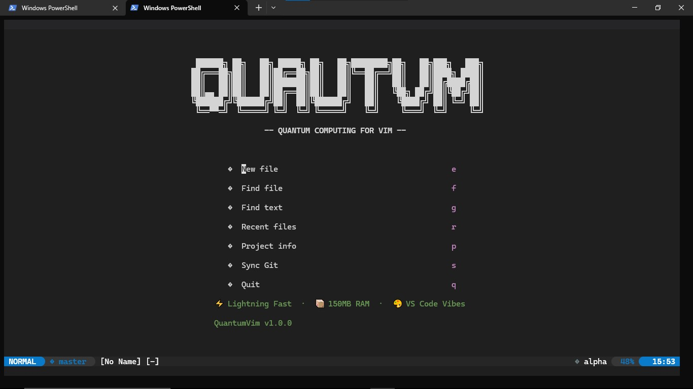
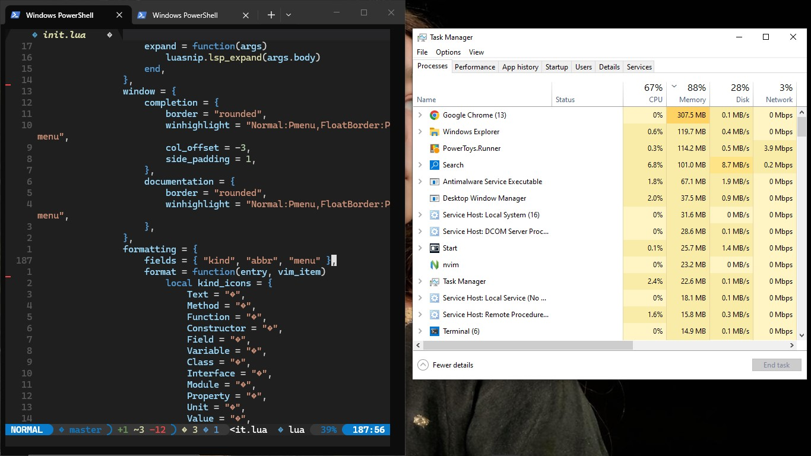

## 💰 Commercial Tools

## ⚡ Quantum Vim – $10

### VS Code Vibes. Neovim Power. Zero Config.





**Open it. Start coding. That's it.**

- **22.6 MB RAM** – Lighter than Task Manager itself. Runs on a Raspberry Pi.
- **0.3% CPU** – Your terminal uses more resources.
- **Stunning startup** – Every time you open it, it feels premium
- **VS Code vibes** – Familiar feel, terminal speed
- **All tools included** – LSP, autocomplete, file tree, git integration – ready to go

### Why $10?

- **Save 10+ hours** of configuring Neovim from scratch
- **Lifetime updates** – never pay again
- **Priority support** – I'll help you if something breaks
- **22.6 MB** – Less RAM than a single Chrome tab. Seriously.

> **Launch Price: $10** – Use code `SUPERPOSITION` for 10% off (first 100 buyers)

**👉 [Buy Quantum Vim Now](https://buy.polar.sh/polar_cl_e7ZaWRsYzDbr17dP5fi8yNEdWUau35AHzPG6X3fM2mA)**

---

### Pathfix v2 – Never Fight Your PATH Again

One command to fix PATH issues forever. Works on Windows, macOS, Linux.

**Features:**
- Add directories to PATH permanently
- Check if commands are accessible
- Diagnose PATH problems with `doctor`
- Sync PATH across bash, zsh, fish, PowerShell
- Backup and restore configurations

**Price: $15 (lifetime updates for v2.x)**

👉 [Buy Pathfix v2](https://kashiflyas.gumroad.com/l/kkszxi)

---

### Omarchy v2 – The $5 Shortcut Manager

**Stop typing long commands. Start using 3-letter shortcuts.**

#### Before Omarchy v2:
```powershell
# 27 characters just to check your version
omarchy version

# Every. Single. Time.
```

#### After Omarchy v2:
```powershell
# One-time setup
tap add show-version "omarchy version"
✅ Shortcut added: show-version → omarchy version

# Now just type:
show-version
Omarchy v2.6.0
```

That's it. No external tools. No config files. Just shortcuts that work.

#### What else can you do?

| Without Omarchy v2 | With Omarchy v2 ($5) |
|---------------------|----------------------|
| `omarchy sync -a` | `sync` |
| `docker-compose down -v && docker-compose up -d` | `dbreset` |
| `git add . && git commit -m "quick fix" && git push` | `push "quick fix"` |
| `ssh deploy-server && cd /var/www && npm run build` | `deploy` |

**Create ANY shortcut for ANY command – with arguments.**

#### Why $5?

- You'll save **minutes every day**
- That adds up to **hours every month**
- **One-time payment. Lifetime updates.**
- No subscriptions. No hidden fees.
- **No external dependencies.** No PowerShell modules to install. Just `tap add` and go.

👉 [Buy Omarchy V2](https://buy.polar.sh/polar_cl_zvnuIMcqUEG0ghrgaFfFV9PivHvnI9esOA40D25wvUK)

---

# 🚀 Omarchy ━━━━ "One Final Fix Update"

**One CLI to rule your dev workflow — git, scripts, env, cleanup, and more.**

[](https://go.dev/)
[](https://github.com/Taha95-dev/Omarchy-CLI-tool)
[](https://github.com/Taha95-dev/Omarchy-CLI-tool/releases)

---

## ✨ Features

| Command | What It Does |
|---------|--------------|
| `omarchy doctor` | Concurrent diagnostic suite for environment health |
| `omarchy cleanup` | Aggressive recursive purge for build artifacts and logs |
| `omarchy run` | Smart script runner (dev/build/test automation) |
| `omarchy sync` | Secure Git orchestration with safety validation |
| `omarchy info` | Instant project analytics (LOC, TODOs, Git health) |
| `omarchy db` | Database migrations and lifecycle management |
| `omarchy use` | Create new project from saved template |
| `omarchy save` | Save current project as a template |

---

## 🚀 Quick Start

```bash
# Clone and build
git clone https://github.com/Taha95-dev/Omarchy-CLI-tool.git
cd Omarchy-CLI-tool
go build -o omarchy

# Run anywhere
./omarchy run dev
./omarchy info
./omarchy cleanup --docker
```

Or [download the latest release](https://github.com/Taha95-dev/Omarchy-CLI-tool/releases).

---

## 📖 Examples

### Templates

```bash
# Save current project as a template
omarchy save my-starter

# List saved templates
omarchy list-templates

# Create new project from template
omarchy use my-starter new-project
```

### Get instant project insights

```bash
$ omarchy info
📊 Project Info
━━━━━━━━━━━━━━━━━━━━━━━━━━━━━━━━━━
📁 Files:         127
🧮 Lines:         8,452
🐛 TODOs:         3
🌿 Branch:        main
⏰ Last commit:   2 hours ago
```

### Git sync with safety

```bash
omarchy sync -a          # auto-commit + push
omarchy sync --tag v1.0  # commit + tag + push
```

---

## 🧠 Why Omarchy?

- **One tool** — no more switching between git, npm, docker, find, du, grep
- **Safety first** — won't let you commit your home folder or drop a production DB without confirmation
- **Fast** — written in Go, runs everywhere
- **Zero config** — works out of the box

---

## 🤝 Support

**Omarchy is made on a laptop with 4GB RAM, I5 3330U, HDD** — if you find it useful, consider giving it a ⭐ on GitHub.

---

## 📦 Installation

### From source

```bash
go install github.com/Taha95-dev/Omarchy-CLI-tool@latest
```

### From releases

Download the binary for your OS from [Releases](https://github.com/Taha95-dev/Omarchy-CLI-tool/releases).

---

## 📝 License

MIT — use it, learn from it, build something awesome.

---

## 🙌 Credits

Built by [Taha](https://github.com/Taha95-dev) — because building tools is better than waiting for them.

---

## Windows Defender False Positive

Windows Defender may flag `pathfix.exe` as a virus. This is a **false positive** — a known issue with Go binaries.

**Your file is safe.** Here's how to fix it:

1. Open Windows Security → Virus & threat protection
2. Click "Manage settings" under Virus & threat protection settings
3. Scroll to "Exclusions" → "Add or remove exclusions"
4. Add the folder where you downloaded `pathfix.exe` as an exclusion
5. Run the file again

[Verify the file checksum](https://github.com/Taha95-dev/Omarchy-CLI-tool/releases/download/v2.6.0/checksums.txt) to confirm integrity.

---

**Omarchy v1 remains free and open source (MIT).**
